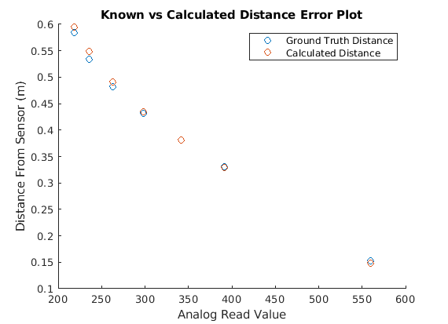

## Intro 
This project explores one possible way of making a 3d scanner or rather a 3d-scan from a given point. This project shows how this can be done with relatively few low-cost materials. The project uses an arduino, 2 hobby-size servos and one [IR rangefinder](https://www.pololu.com/product/1137) to measure distance. A scan will be made via a pan/tilt mechanism that allows the sensor to read a variety of different distances for different points within the range of the mechanism. 

Here’s a photo of our final results of a scan of the letter “O” in Figure 0.0 resulting from the setup shown in Figure 0.1.
<p align="center">
  
  <i>Figure 0.0: 3D Point Cloud from Scan Data of the "O" </i>
  <br>
  <br>
  
  <br>
  <i>Figure 0.1: Setup and Scan Environment</i>
</p>

Please see these links if you are looking for all files used:

[CAD](https://cad.onshape.com/documents/00404c6b682243b94410b231/w/e0565735532057e490157cf3/e/47ad195450b799a5f13700f5)

[Code](https://github.com/teadetime/pieScanner/)

## Testing Equipment
___

### Testing Sensors
The feasibility and accuracy of our system hinges entirely on how precise and accurate of measurements we can read. Servos are very good at accurately positioning themselves however, we were curious how stable the readings from the Sharp IR Rangefinder were. 
We started out simply reading the distance as an analog value with a 10 µF capacitor between 5v and ground as per the [sensor datasheet](https://www.pololu.com/file/0J156/gp2y0a02yk_e.pdf). We tested several scenarios to obtain clean data from the sensor:


__Sample once every 2 seconds__
  - This was our first test to verify the sensor was attached correctly
  - Established range of sensor from reading ~50 to ~600 out of the theoretical 0-1023 [units](https://www.arduino.cc/reference/en/language/functions/analog-io/analogread/)
  - Data obviously followed a trend but the readings were slightly different each time (+/- 5 units)

__Average values for 1 second reading every loop without delays__
- This tried to smooth our input and it did in a way but we got ridiculously low values (could have been programming error)
- Results showed more stability, but less resolution despite being stable
- We attributed error to reading too quickly (see next experiment)

__Average values for 1 second reading every loop with a loop time of ~50ms__
- This gave us average values that were similar to what our one-off readings were
- More stable than single readings but still had large jumps occasionally
- This spurred more investigation into the values that we were getting so we looked at 5 seconds of data polling every 50ms
  <p align="center">
    
    <br>
    <i>Figure 1.0: 5 Seconds of sensor data sampled every 50ms, Note the spikes</i>
  </p>
- Obviously Figure 1.0 has a periodic spike that we don’t want that could be throwing our average off (See next approach)

__Trim high and low values and average with a loop time ~50ms__
- We will trim out the extremes of our readings(spikes in either direction)
- This requires sorting the values before averaging. Values are stored in an array and then sorted via [qsort](https://en.cppreference.com/w/c/algorithm/qsort) from the C Standard Library
  ``` c 
  short cmpfunc (const void * a, const void * b) {
    return ( *(short*)a - *(short*)b );
  }
  qsort(distArray, numReadings, sizeof(short), cmpfunc);
  readingCounter = 0;
  // Now Average
  for (int i=arrayFront; i<(sizeof(distArray) - arrayBack)/sizeof(distArray[0]); i++) {
    readingCounter += 1;
    totalReading += distArray[i];
  }
  avgReading = totalReading/readingCounter;
  //Now Send
  Serial.println(avgReading);    Serial.print(",");
  ```
- This approach stores consecutive readings rather than summing them (increased memory usage) and takes more time
- Very Accurate and precise. Values are stable and change significantly less than other methods.

__Learning that material matters__

During these tests we were primarily measuring a large piece of cardboard perpendicular to the sensor. However, during some of the tests we used a different tissue box that totally messed up readings.
<p align="center">
  
  
  <br/>
  <i>Figure 1.1:  Reflective Tissue Box(Left) and Resulting Sinusoidal Sensor Readings (Right)</i>
</p>

Figure 1.1 shows the tissue box and the sequential readings over 25 seconds. These exhibit a huge range and are sinusoidal with a consistent period?! This was very confusing and we are unsure how this happened except for the fact that the material was somewhat reflective. Based on this info we will be testing with just cardboard and matte surfaces.


#### Calibrating Sensor
Obviously the units that we get from the Arduino are not representative of a distance that we can understand. To understand the relationship between our sensor readings and real-world distance we will create a calibration curve looking at sensor data as it relates to a known measurement. This curve will be curvefit over the effective distance range (20-150cm) such that we can estimate a distance based solely on a sensor reading. This process was done as shown in Figure 1.2 using a stationary sensor, and a large matte object at known distances(hence the tapemeasure).

Our calibration setup used a large matte object with our sensor perpendicular to it.
<p align="center">
  
  
  <br>
  <i>Figure 1.2:  Calibration setup(Left) and resulting sensor readings for calibration curve (Right)</i>
</p>


From the data in Figure 1.2 we were able to curve fit an equation that related the Arduino AnalogRead voltage to the distance in meters. Figure 1.3 shows this plot, note that it is not linear! The equation for this relationship is given in Figure 1.4 where “v” is the AnalogRead value.
<p align="center">
  
  <br/>
  <i>Figure 1.3:  Calibration Graph showing curve-fit equation</i>
  <br>
  <br>
  
  <br/>
  <i>Figure 1.4: Resulting equation of curve fit in Figure 4 </i>
</p>

We wanted to validate how well our calibration curve was working so we took measurements a separate day with data points that were not in our curve fit. This data allowed us to compare our prediction(made using our conversion equation) to the ground truth (measurement via a ruler). Figure 1.5 shows this data. Note that the predicted values are very close to the actual values. For reference, the value that is furthest off is <.5”. This validates our calibration curve.
<p align="center">
  
  <br>
  <i>Figure 1.5:  Error plot of predicted vs actual distances for never-seen data</i>
</p>

## Mechanism Design
The pan tilt mechanism was 3D-printed and designed from scratch. The CAD can be found [here](https://cad.onshape.com/documents/00404c6b682243b94410b231/w/e0565735532057e490157cf3/e/47ad195450b799a5f13700f5). We focused on making our parts small but still stiff and using press-fit connections instead of additional fasteners. We need the mechanical system to be stiff such that we can get repeatable positioning. 

Another key point is to ensure that all rotation is around the center of the sensor. If the sensor translates in space during movement, we would need to do math to determine the new position of the sensor as opposed to having a constant location for our sensor. For example if we scanned a sphere from it’s centerpoint we would expect that our distance readings should be the same for all points. If our mechanism was designed such that rotation didn’t go through the sensor we would have different distance readings since the sensor would be translating in the sphere during a scan.

The CAD model in Figure 2.0 doesn’t show the sensor or servos but is roughly laid out in the correct space. The pan and tilt parts are shown in greater detail in Figure 2.1.
<p align="center">
  
  
  <br>
  <i>Figure 2.0: Pan/Tilt Scanner(Left) and CAD used to manufacture parts(Right)</i>
  <br>
  <br>
  
  
  <br>
  <i>Figure 2.1: Pan bracket CAD(Left) and Tilt Bracket CAD(Right)</i>
</p>

#### Final Circuit Picture and Diagram
<p align="center">
  
  <br>
  <i>Figure 2.2: Circuit Digram with Button, IR Rangefinder and 2 Servos</i>
</p>

Figure 2.2 shows the layout of our circuit. This adds a button for us to start and switch between scanning modes. Our two servos are controlled via the [arduino servo library](https://www.arduino.cc/reference/en/libraries/servo/) and are wired to PWM pins on the Arduino. The IR Rangefinder is an analog sensor so its output is connected to an analog pin on the Arduino.


## Data processing
As mentioned previously while testing the sensor we did a lot of processing to the output o achieve accurate and precise results. One thing that we didn’t mention is the field-of-view of the sensor. We calibrated with large flat pieces of cardboard when in reality we will be reading the edge which may give back weird data. This is something we are ignoring for the purposes of this project but could handle on the software side or simply do multiple scans from different directions.

We mention a “scan” many times but do not define it well. A scan is the movement of our pan/tilt mechanism through a variety of pan and tilt angles such that we are receiving distance measurements for the area that we move through. This data can then be used to create a 3d mapping of those points in space and hence the object/view that our scanner is looking at.

#### Sending/Receiving the Data
The Arduino works great to do simple processing but is not appropriate for doing distance calculation, point conversions, or visualization of our scans. For this reason we are sending the basic data. Figure 3.0 showsthe angle that each servo is pointing, and the distance recorded by the sensor beings sent over serial to our computer. The computer receives this data, as shown in Figure 3.1, in Matlab and is able to does post-processing to convert these polar coordinates into cartesian space. (See Conversion from Polar to Cartesian for more info)
``` c
qsort(distArray, numReadings, sizeof(short), cmpfunc);
readingCounter = 0;
// Now Average
for (int i=arrayFront; i<(sizeof(distArray) - arrayBack)/sizeof(distArray[0]); i++) {
  readingCounter += 1;
  totalReading += distArray[i];
}
avgReading = totalReading/readingCounter;
Serial.print(panPos-panZero);    Serial.print(",");
Serial.print(tiltPos-tiltZero);    Serial.print(",");
Serial.print(avgReading);    Serial.print(",");
Serial.println("0");
```
<p align="center">
  <i>Figure 3.0: Arduino Code Snippet that averages data and sends it via Serial</i>
</p>
<br>
</br>

```Matlab
% Conversion from Polar to Cartesian Coordinates
port = "/dev/ttyACM0" %Choose which port to use for Arduino (proabably best to hardcode)
baudrate = 9600;
s = serialport(port,baudrate);
q = 0
values = NaN(1,4);
%initialize a timeout in case MATLAB cannot connect to the arduino
timeout = 0;
% main loop to read data from the Arduino, then display it%
while timeout < 10    %    % check if data was received    %    
    while s.NumBytesAvailable > 0     
        timeout = 0;        
        %        
        % data was received, convert it into array of integers        
        %        
        value = eval(strcat('[',readline(s),']'));              
        a = value(1);        
        b = value(2);        
        c = value(3);        
        d = value(4);          
        disp(sprintf('a,b,c,d = %d,%d,%d,%d\n',[a,b,c,d]));
        q = q + 1;
        values(q,:) = [a b c d]; % Put data into a useable format
    end
    pause(0.5);    
    timeout = timeout + 1;
end
```
<p align="center">
  <i>Figure 3.1: Matlab code snippet that collects Arduino data(Figure 10) via Serial</i>
</p>

#### Preliminary Single Scan
Our scanning method consists of many single scans going from left-to-right and right-to-left(think zigzag grid). We started by doing a single scan with no tilt enabled across the letter “O”. We expect there to be 2 clusters of values with low distance readings (the parts of the O) and the rest of the points to be very far away. Figure 3.2 shows our setup and Figure 3.3 shows the resulting scan in angle vs distance and cartesian space. These plots make sense as they show two groups of points that are closer to the sensor. These are the two parts of the "O" since we scanned near the middle of it.
<p align="center">
  <br>
  
  <br>
  <i>Figure 3.2: Single Scan Setup</i>
  <br>
  <br>
  
  
  <br>
  <i>Figure 3.3: Single scan angle versus distance(Left) and the same data in a cartesian space "top-down"(Right)</i>
</p>

#### Conversion from 3d Polar to Cartesian points (Stella)

``` matlab
% Conversion from Polar to Cartesian Coordinates
distance = polyval(p,values(:,3));                    % Calculate Distance in Meters
scat(:,1) = distance(:,1).* cosd(values(:,1)).*cosd(values(:,2)); % X Zalues
scat(:,2) = distance(:,1).* sind(values(:,1)).*cosd(values(:,2));  % Y Values
scat(:,3) = distance(:,1).* sind(values(:,2));                % Z Values

```
<p align="center">
  <i>Figure 3.4: Matlab snippet that converts polar coordinates to cartesian</i>
</p>
#### Final 3d Scan
We wanted to push our scanner ans see how it did on more than a single letter! We decided to try scanning a corner in the hallway from ontop of a table. This scan was large and took ~10 minutes. Figure 3.5 shows the setup and resulting final scan(on the computer screen).

<p align="center">
  <br>
  
  <br>
  <i>Figure 3.5: 3D scan of wall and table, note the wd plot's match to real space</i>
</p>
This plot owkred really well and was able to pick up many of the features within the scan range like the edge of the table and the corner. Better yet, our walls appeared very flat!

## Other notable code parts
Our entire code can be found [here](https://github.com/teadetime/pieScanner/). The key pieces have already been called out in earlier portions of this doc.

However, we also wanted to highlight some other cool features of our code. For instance in addition to averaging, sorting and trimming values, we wait for the servo to be in position for a specified amount of time. This is shown in Figure 4.0 and ensures that the servo has stopped twitching and the mechanism is at rest
``` c
if(moving){
  // Make sure it's been step delay time since moving
  if((currTime - lastStepTime) > stepDelay ){
    moving = false;
  }
}
else{//NOT MOVING, this means we are reading from sensor!
  if (readingCounter >= numReadings){
    LastStepTime = currTime;
    moving = true;
    . . . 
  }
  . . . 
}
```
<p align="center">
  <i>Figure 4.0: Arduino snippet showing pause for movement to stop</i>
</p>

We also programmed a separate mode that passes our array of data over serial for plotting in Matlab. This was used for inspection of readings over time. Figure 4.1 shows this mode.
``` c
else if(mode == 1){
    if(readingCounter < numReadings){
      distArray[readingCounter] = analogRead(distPin);
      readingCounter += 1;
      delay(readRate); //Take readings 50 ms apart
    }
    else{
     for(int i=0; i<sizeof(distArray) / sizeof(distArray[0]); i++)
     {
        Serial.print("");
        Serial.print(i);
        Serial.print(",");
        Serial.print(distArray[i]);
        Serial.print(";");
     }
     Serial.println("\n");
     qsort(distArray, numReadings, sizeof(short), cmpfunc);
     readingCounter = 0;
     // Now Average
     for (int i=arrayFront; i<(sizeof(distArray) - arrayBack)/sizeof(distArray[0]); i++) {
       readingCounter += 1;
       totalReading += distArray[i];
     }
     Serial.println("\n");
     avgReading = (totalReading/readingCounter);
     Serial.println(avgReading);
        
    readingCounter = 0;
    totalReading = 0;
    delay(2000);
      
    }
  }
```
<p align="center">
  <i>Figure 4.1: Sending reading array via serial</i>
</p>

Figure 4.2 shows the core of our scanning code is moving the servo, checking to see if a reading should be sent and if the tilt servo should be moved up. This causes a side-to-side “grid” scanning motion.

``` c
void loop() {
  currTime = millis();
if(moving){
      // Make sure its been step delay time since moving
      if((currTime - lastStepTime) > stepDelay ){
        moving = false;
      }
    }
    else{//NOT MOVING, this means we are reading from sensor!
      if (readingCounter >= numReadings){
        lastStepTime = currTime;
        moving = true;
        qsort(distArray, numReadings, sizeof(short), cmpfunc);
        readingCounter = 0;
        // Now Average
        for (int i=arrayFront; i<(sizeof(distArray) - arrayBack)/sizeof(distArray[0]); i++) {
          readingCounter += 1;
          totalReading += distArray[i];
        }
        avgReading = totalReading/readingCounter;
        Serial.print(panPos-panZero);    Serial.print(",");
        Serial.print(tiltPos-tiltZero);    Serial.print(",");
        Serial.print(avgReading);    Serial.print(",");
        Serial.println("0");
        readingCounter = 0; // Reset the array so that it can be repopulated
        avgReading = 0;
        totalReading = 0;

        //NOW DO THE PANNING
        if(panningRight){
          //Set the servo to next position
          panPos += panStep;
          if(panPos > (panMax+panZero)){
            //Time to move up
            panPos = (panMax+panZero);
            movingUp = true;
            panningRight = !panningRight;
          }
        }
        else{
          panPos -= panStep;
          if(panPos < (panMin+panZero)){
            //Time to move up
            panPos = (panMin+panZero);
            movingUp = true;
            panningRight = !panningRight;
          }
        }
        panServo.write(panPos);
        //MOVE UP IF Needed
        if(movingUp){
          tiltPos += tiltStep;
          if(tiltPos > (tiltMax+tiltZero)){
            //Serial.println("ALL DONE");     //Reached the top of the scan Stop sending Message so matlab breaks
            // Do cleanup so another scan can be run
            tiltPos = (tiltMin+tiltZero);
            panPos = (panMin+ panZero);
            mode = 2;
          }
          else{
            tiltServo.write(tiltPos);
          }
          movingUp = false;
        }
      }
      // It's not time to move, do another reading
      else{
        distArray[readingCounter] = analogRead(distPin);
        readingCounter += 1;
        delay(readRate); // Don't sum readings all the time because that makes error
      }
    } 
}
```
<p align="center">
  <i>Figure 4.2: Core panning logic, including data pre-processing</i>
</p>

## Reflection
